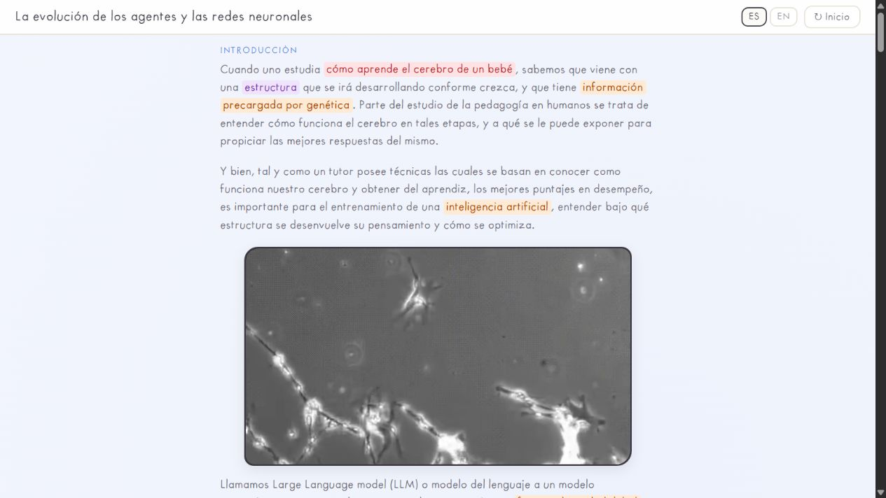
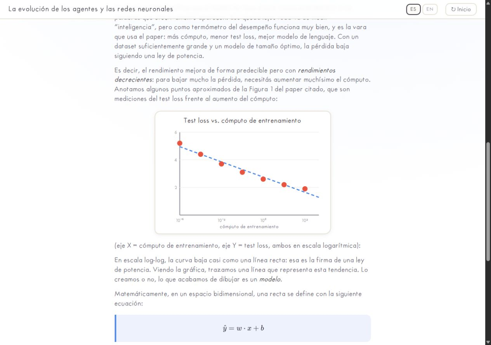
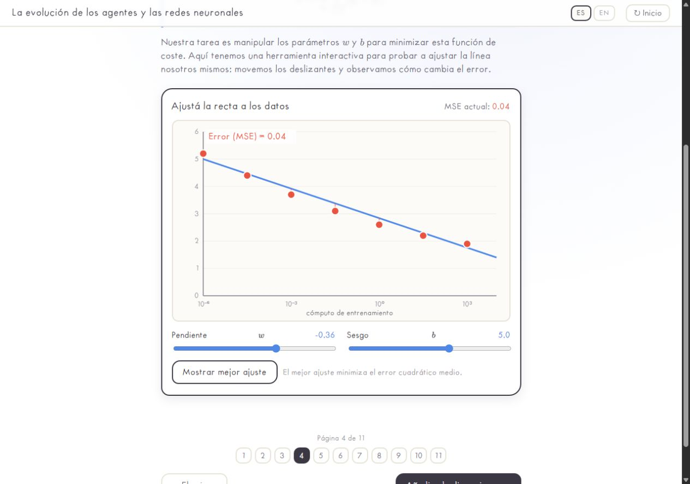
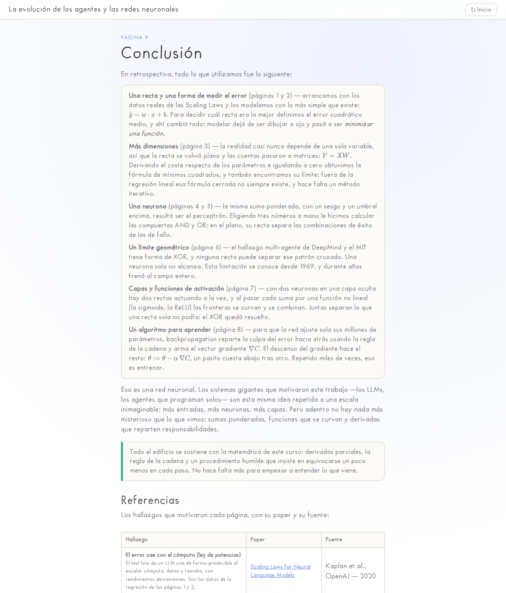

# The evolution of agents and neural networks

A **Calculus II** project: an interactive web page that explains what is behind neural networks — how they learn, how they are optimised and where they came from — using nothing but the mathematics of the course.

**➜ Live site:** [Open the project](https://juanm4ram.github.io/neuralNetworks/) · [Introduction](https://juanm4ram.github.io/neuralNetworks/#intro)

*🇦🇷 [Leer este README en español](README.es.md) · the site itself is bilingual (EN / ES switch in the top bar).*


---

## Why this project

An important part of learning to work with AI agents is understanding how *they* learn. Behind every agent there are enormous mathematical functions, and the surprising part is that the machine itself is what manages to find them: nobody picks its billions of parameters by hand.

We wanted to show that journey without black boxes. Every formula on the site can be followed with pencil and paper using the tools of Calculus II: partial derivatives, the chain rule, minima of functions. The thesis of the project is that this is enough to understand how artificial intelligence is able to generate meaningful text.

## How we approached it

- **An expanded introduction.** A learning analogy leads into language models, token IDs, embeddings, Transformer blocks and learned parameters. The introduction uses LaTeX formulas, colored text panels and a visual token-to-vector example.
- **A story in 9 pages, from simple to complex.** The site reads like a notebook: a line fitted to real data (page 1) → the error as a function to minimise (page 2) → more dimensions and least squares (page 3) → the perceptron (page 4) → AND/OR gates (page 5) → the XOR limit (page 6) → layers and activation functions (page 7) → backpropagation and gradient descent (page 8) → conclusion and references (page 9).
- **Real papers as the through-line.** Each mathematical concept enters when a real finding demands it: linear regression shows up to model OpenAI's Scaling Laws, and XOR shows up because the DeepMind + MIT multi-agent finding (multi-agents help on parallelisable tasks and hurt on sequential ones) has exactly that shape.
- **Interactive where it adds value, static where it does not.** Page 2 has a tool to drag the slope and bias of the line and watch the mean squared error change live. The rest are SVG charts drawn in code, with no libraries.
- **Language selection.** Navigation and the nine chapters support English and Spanish, with English selected by default. The expanded introduction is currently in Spanish in both modes. The language choice is remembered across visits.
- **Handmade aesthetic.** Handwritten typography, paper colours and an animated cover (a homage to Nicky Case's *The Evolution of Trust*): it should feel like a notebook, not a corporate deck.
- **No dependencies, no build step.** Vanilla HTML + CSS + JS; only MathJax from a CDN for the formulas. Deploying means copying static files.

## The walkthrough, in screenshots

**Introduction — learning and language models.** The opening analogy and video introduce the model, with color highlights for key concepts.



**Introduction — from tokens to the input vector.** Separate token boxes correspond to the IDs in the LaTeX vector, inside a dedicated text panel.


**Page 1 — the real data and the first line.** The test loss of OpenAI's models falls with compute following a power law; on a log-log scale it is almost a straight line, and that line is our first model:



**Page 2 — the error as a function.** The interactive tool: you move the slope and the bias, and the mean squared error tells you how good your line is:



**Page 6 — the limit.** The multi-agent finding has the shape of an XOR and no straight line can separate that pattern: the geometric reason why networks are needed:


**Page 9 — the conclusion.** A recap of everything used, stage by stage, plus the references:



## Running it locally

There is nothing to install. Any static server will do:

```bash
# With Python
python -m http.server 8000

# or with Node
npx http-server -p 8000 -c-1
```

Open `http://localhost:8000` and navigate with the buttons, or with the numbered pager (1–9) available at the bottom of every page. You can also jump straight to a page with the hash: `http://localhost:8000/#cap6`.

## Project structure

```
neuralNetworks/
├── index.html      # Introduction and 9 chapters (Spanish source text)
├── styles.css      # "Handmade" aesthetic (paper, handwritten type)
├── app.js          # Navigation, animated cover, charts and references table
├── i18n.js         # ★ English dictionary + language engine (default: English)
├── papers.js       # Bibliography: only the papers cited in the text (data only)
├── assets/         # Font, images and README screenshots
├── videos/         # Supporting animations
└── PaperSequentialParallel.pdf  # The Plancraft paper (page 6)
```

### How the bilingual layer works

The HTML source is written in Spanish, and every translatable block carries a `data-i18n="tNNN"` key. `i18n.js` holds the English string for each key and applies them on load — English is the default, and the reader's choice is stored in `localStorage`.

Switching language reloads the page (keeping the current section through the `#hash`) so that canvases, SVG labels and generated tables are rebuilt in the chosen language, with no stale text left behind.

To translate a new block: add `data-i18n="tNNN"` to the element in `index.html` and its English string to the `EN` dictionary in `i18n.js`. Chart labels and other strings that never live in the DOM are looked up with `I18N.t('key')`.

`papers.js` contains only the papers **cited in the text** (\[1]–\[5]), in the same order as the citations; the references table on page 9 is generated from it. Each entry carries an `en` block with its English version. To add a reference, append an entry to the array and cite it in the text.

## References

| # | Finding | Paper | Source |
|---|---|---|---|
| [1] | Error falls with compute | [Scaling Laws for Neural Language Models](https://arxiv.org/abs/2001.08361) | Kaplan et al., OpenAI — 2020 |
| [2] | Thinking for longer improves the answer | [Chain-of-Thought Prompting](https://arxiv.org/abs/2201.11903) | Wei et al., Google — 2022 |
| [3] | Multi-agent: it depends on the task (XOR) | [Towards a Science of Scaling Agent Systems](https://arxiv.org/abs/2512.08296) | DeepMind + MIT — 2025 |
| [4] | Sequential tasks chain dependencies | [Plancraft (Minecraft)](https://arxiv.org/abs/2412.21033) | Univ. of Edinburgh — 2025 |
| [5] | Multi-layer networks can tune themselves | [Learning representations by back-propagating errors](https://www.nature.com/articles/323533a0) | Rumelhart, Hinton and Williams — 1986 |
